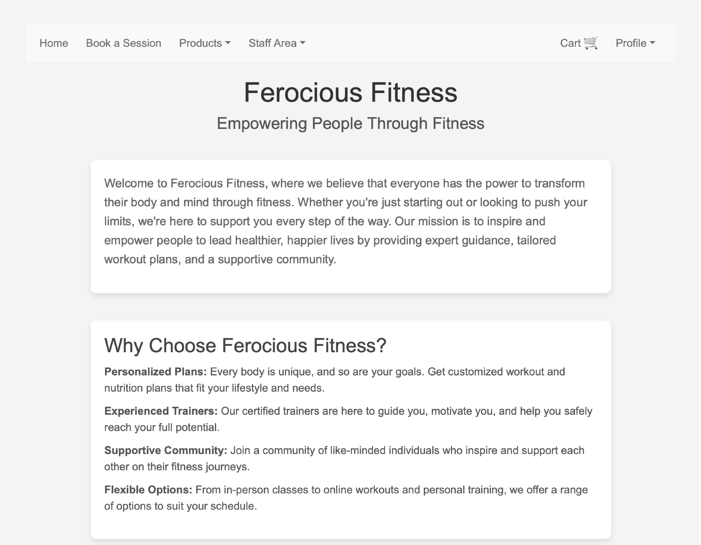
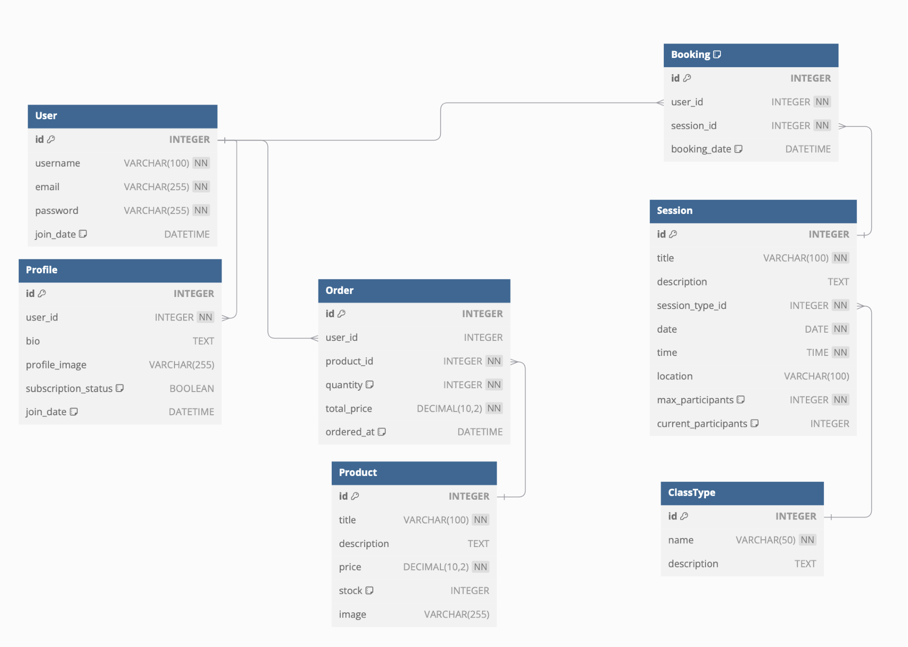
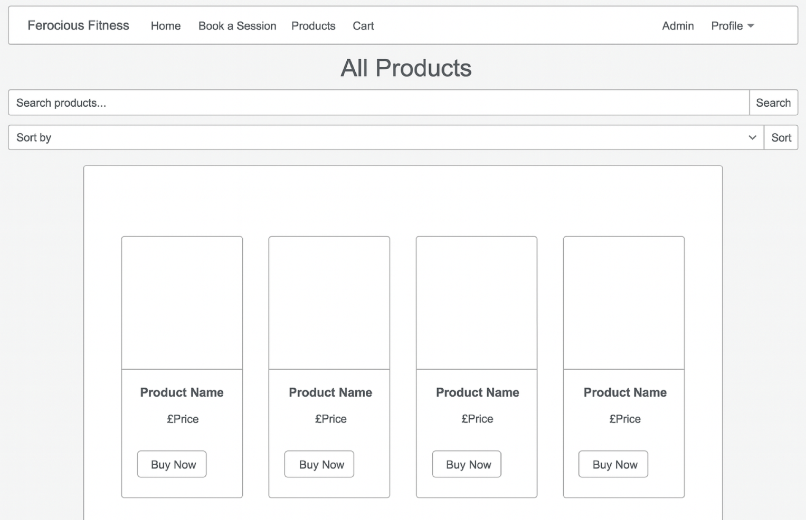

Link to live project: [Ferocious Fitness](https://ferocious-fitness-1a2086a68872.herokuapp.com/index.html) 

## Table of Contents
- [Project Background & Summary](#project-background--summary)
- [User Experience (UX)](#user-experience-ux)
- [Features & Structure](#features--structure)
- [Design](#design)
- [Technologies Used](#technologies-used)
- [Testing](#testing)
- [Deployment](#deployment)
- [Credits](#credits)
- [References & Resources Used](#references--resources-used)

## Project Background & Summary
This project is a Django-based fitness club website. The motivation behind this project was to provide a user-friendly application for managing fitness sessions, tracking user progress, and maintaining user profiles. It aims to merge the power of Django as a Python web framework with a clean and intuitive frontend, making club management simple and efficient. The project demonstrates the ease of CRUD (Create, Read, Update, Delete) operations with Django.

The project provides a simple interface where users can view, book, and manage fitness sessions, update their profiles, and buy products. This is designed to be flexible enough for expansion and suitable for different types of users, from fitness enthusiasts to personal trainers.

The scope of the project changed significantly over the course of development. As can be seen from the project flow summary below, many features have been abandoned. In fact, the project is not working as smoothly as I would like, and there are a number or known bugs that I have been unable to solve in the time available to me. Notable issues are:

* Styling: For some reason, some key styles were not being applied as they ought to have been. I tried debugging this is every way I could think of, and in the end resorted to putting custom css in the html files. I know this is bad practice, and no doubt I would have been able to debug given enough time.
* Signup is required for booking on to fitness sessions. This should be behind a paywall, but I ran out of development time.
* Staff should also be able to review the number of bookings so they can see which members are booked onto upcoming sessions.
* Users should be able to review orders they have placed, but cannot currently do so.

### The initial data model


## User Experience (UX)
### User Stories
#### First Time Visitor Goals

|Goal   |Achieved?|
|-------|---------|
|As a First Time Visitor, I want to easily understand the purpose of the application and how to navigate through it.|The purpose of the app is clear and navigation is intuitive|
|As a First Time Visitor, I want to be able to search for fitness sessions and see the details.|The search function is obvious on the home page and session/product links are clearly displayed|
|As a First Time Visitor, I want a simple way to buy products and consider signing up.|There is a navbar link for all relevant sections|

#### Returning Visitor Goals
|Goal   |Achieved?|
|-------|---------|
|As a Returning Visitor, I want to easily find the sessions I have booked onto.|These are visible in the Profile section|
|As a Returning Visitor, I want to view product orders I have placed.|This is currently unavailable|
|As a Returning Visitor, I want to stay informed about any new updates to the platform.|There is currently no mechanism to do this|

#### Frequent Visitor Goals
|Goal   |Achieved?|
|-------|---------|
|As a Frequent Visitor, I want to see all the upcoming sessions I have booked onto.|These are displayed in date order on the profile page|
|As a Frequent Visitor, I want to ensure that the system functions smoothly with all its features, including booking management and purchasing products.|Bookings can be made and cancelled with ease. Booking onto the same class twice is not possible|
|As a Frequent Visitor, I want to access the system without any technical errors or bugs.|Currently, everything runs smoothly|

## Features & Structure
### Existing Features
- **Homepage & Navigation**: The homepage provides users with a clean and simple interface, displaying basic information about the Ferociously Fit club.
- **Product Listing**: Users can view products, choose between buy now and add to basket, and proceed to checkout.
- **Add/Edit/Delete Profile`**: Users can edit their profile information.
- **Session Management**: Users can book onto sessions and cancel sessions.
- **User Authentication**: Authentication ensures that only registered users can access full functionality, including booking onto sessions (although this should be behind a paywall).
- **Search Functionality**: A search bar allows users to quickly find and sort products.

### Future Features
- Improve general styling. I'm aware that the styling leaves much to be desired, however with limited time, my focus was on the data and business logic.
- Put signup behind a paywall
- Add email notifications to confirm booking sessions and product purchase
- Allow different ways of displaying the products (e.g. alphabetically, most popular etc.)
- Hook up email functionality
- If the project were to grow any larger I would modularise the codebase

## Design

### Wireframe



### Typography
The application uses classic and clean Arial sans serif fonts so that users have an intuitive and pleasant user experience.

### Colour Scheme
The application uses neutral colors, such as off-whites and browns, to maintain a classic and functional appearance, without unnecessary distractions. However, a skilled designer would improve the look and feel no end.

## Technologies Used
### Languages
- Python (Django framework)
- HTML5
- CSS3
- JavaScript (for frontend interactivity)

### Applications
- Git - for version control.
- GitHub - for version control and hosting.
- Visual Studio Code - for developing the project.

### Frameworks, Libraries & Tools
- Django - The primary backend framework.
- Django template language - For templating in HTML.
- PostgreSQL - for production database system.
- Bootstrap - For responsive and mobile-friendly design.

### Other Tech & VS Code Extensions
- [Flask Debug Toolbar](https://flask-debugtoolbar.readthedocs.io/) - for debugging and testing.
- [Prettier](https://prettier.io) - for code formatting.
- [Github Copilot](https://github.com/features/copilot) for debugging and efficient use of terminal. Please note that I was unable to get Django to automatically upload my static and media files to S3. I was able to get this to work with a manual script thanks to Copilot. These scripts are here: ferociousfitness/management/commands/upload_xxx_to_s3.py.
- ChatGPT/DALLE for generating original images

### Learning Resources
- [Django Documentation](https://docs.djangoproject.com/en/5.1/) - for backend guidance.
- [W3Schools](https://www.w3schools.com) - for frontend and design inspiration.
- [Stack Overflow](https://stackoverflow.com) - used extensively throughout the project. Too many articles to list individually.
- [Codecademy](https://www.codecademy.com) - the course on Django was invaluable.
- * Other References  
  * https://dev.to/chukslord1/building-an-appointment-scheduler-app-with-django-and-fauna-2n9o
  * https://www.youtube.com/watch?v=XX8O2JNIOQo
  * https://docs.djangoproject.com/en/5.1/ref/contrib/messages/
  * https://channels.readthedocs.io/en/latest/introduction.html#turtles-all-the-way-down
  * https://docs.fontawesome.com/web/use-with/python-django
  * https://docs.djangoproject.com/en/5.1/ref/request-response/#django.http.HttpRequest.META

## Testing
Extensive manual testing has been carried out to ensure all CRUD operations, form validations, and database interactions work correctly.

### Features Testing
| Feature             | Test Case                               | Outcome                                     |
| ------------------- | --------------------------------------- | ------------------------------------------- |
| Product Search      | Search for a product by title           | Search results display correct entries      |
| Book Session        | View and book onto upcoming sessions    | Sessions are bookable and user feedback confirmation works    |
| Edit Booking Details| Cancellation of existing bookings       | Cancellation works with feedback            |
| Edit Profile        | Edit personal details in profile page   | Details can be successfully changed         |
| Add Product to Cart | Add a product to the shopping cart      | Product is added to the cart and cart updates correctly |
| Checkout Process    | Complete the checkout process           | Order is placed successfully and confirmation is displayed |
| User Registration   | Register a new user account             | User account is created successfully |
| Login               | Log in with existing user credentials   | User is logged in and redirected to the dashboard |
| Add Session         | Add a new fitness session as staff      | Session is added and displayed in upcoming sessions |
| Cancel Session      | Cancel a booked session                 | Session is cancelled and user receives confirmation |
| Subscription Management | Subscribe to a membership plan     | Subscription is created but payment is not processed |
| Responsive Design   | Access the site on different devices    | Site layout adjusts correctly for mobile and tablet views, though I am unhappy with this overall responsiveness |


### Browser Testing
| Browser             | Compatibility | Responsiveness | Issues   |
| ------------------- | ------------- | -------------- | -------- |
| Chrome              | Good          | Okay           | Some CSS isn't linking properly     |
| Firefox             | Good          | Okay           | Some CSS isn't linking properly     |
| Safari              | Good          | Okay           | Some CSS isn't linking properly     |
| Edge                | Good          | Okay           | Some CSS isn't linking properly     |

### Online Validation Services
- **HTML Validator**: Validated with no major errors.
- **CSS Validator**: Passed with no significant issues (3 warnings I have chosen to ignore as insignificant).
- **Flask Debugging**: Used Flask's built-in debugger to resolve any backend issues.
- **PEP 8**: I used flake8 to format my python files according to PEP8 standards. I have exceeded the line length of 79 chars on a few considered occasions as strict adherence would have compromised readability.

## Deployment
The application is deployed on Heroku. 

Please feel free to clone the project and use it for your own site. In order to do this:

### Cloning the Repo
1. Open your terminal and run the following command to clone the repository:```git clone https://github.com/bizboz1981/ferocious-fitness```
2. cd into the new project directory: ```cd ferocious-fitness```
3. Create and activate a virtual environment: <br>```python3 -m venv venv```<br>```source venv/bin/activate``` (On Windows use `venv\Scripts\activate`)
4. Install the required dependencies from the requirements.txt file: ```pip install -r requirements.txt```
5. Create a .env file in the root directory and add the necessary environment variables: ```touch .env```
6. Add the following lines to the .env file: <br> ```SECRET_KEY=your_secret_key``` <br> ```DATABASE_URL=your_database_url``` <br> ```STRIPE_SECRET_KEY=your_stripe_key_here```<br>
```STRIPE_PUBLISHABLE_KEY=your_public_stripe_key_here```<br>
```STRIPE_WEBHOOK_SECRET=your_stripe_webhook_key_here```<br>
```AWS_ACCESS_KEY_ID=your_aws_key```<br>
```AWS_SECRET_ACCESS_KEY=your_secret_aws_key```<br>
```USE_AWS=True```


### Deploy to Heroku
1. Log in to your Heroku account using the Heroku CLI: ```heroku login```
2. Create a new Heroku app: ```heroku create your-app-name```
3. Set environment variables on Heroku:<br>```heroku config:set SECRET_KEY=your_secret_key```
4. Deploy the application to Heroku: ```git push heroku main```


I would like to thank my mentor Jack Wachira for his help and advice.

# Project Flow Summary
✅ Tested and working 🔸 Partially Implemented 🛑 Not yet implemented 💀 Feature abandoned

*	Phase 1: Set up user authentication and profile management. 
*	Phase 2: Build live session management and booking functionality.
*	Phase 3: Implement product listings, checkout, and e-commerce functionality.
*	Phase 4: Create pre-recorded video access for registered users.
*	Phase 5: Implement subscription management and payment processing.

## Phase 1: Core Setup and User Authentication

1.	Project Setup  
* **Create the Django Project**: Start by setting up the Django project and configuring the settings.  ✅  
* **Install Django**: and create the project using django-admin startproject fitness_app.  ✅  
* **Config**: Set up basic configurations, including database settings.  ✅  
* **Install Required Packages**: Install packages for authentication (django-allauth), handling static files, etc.  ✅
* **Define Data Model**: Define data model based on project requirements

2.	Users App: Authentication and Profile Setup  
* **Create the users app**: Set up user authentication using Django’s built-in user model and extend it with a Profile model.  ✅  
* **Build Registration & Login Pages**: Create the registration and login views, using django-allauth. ✅ 
* **Create User Profile Management**: Add functionality for users to view and update their profile.  ✅ 
  * make sure update profile form fields are hidden unless button clicked✅
* **Create URLs and Templates**: Implement URLs for registration, login, and profile management, and create basic templates (register.html, login.html, profile.html).  ✅
* **Test Authentication**: Make sure users can sign up, log in, and manage their profiles. Testing this early is critical, as it’s the foundation of the project.  ✅
* **Add Content to Homepage**: Add copy and images to homepage to show instantly what site is about. ✅  

## Phase 2: Live Session Booking

1.	Sessions App: Live Fitness Sessions and Bookings: Personal training and Group sessions  
* **Create the sessions app**: Set up models for live sessions (Session and ClassType) and bookings (Booking).  ✅  
* **Build Live Session Listings**: Create views and templates to list all upcoming live sessions and allow users to book limited spaces.  ✅  
* **Build Booking Functionality**: Ensure that registered users can book sessions, and handle capacity limits (max participants).  ✅  
* **Build Dashboard for Managing Bookings**: Update the user dashboard to display booked sessions and allow users to cancel bookings if needed.   ✅  
  * If a session is cancelled and goes from 'full' to 'not full', how do I remove 'disabled' class from html 'book now' button?  💀  
* **URLs and Templates**: Implement URLs for session listings (/sessions/), booking (/sessions/<id>/book/), and bookings management.  
* **Notifications**: Add email or SMS notifications for session bookings and reminders. 💀  
* **Calendar Integration**: Allow users to add booked sessions to their personal calendars.💀  

## Phase 3: Products and E-commerce

1.	Products App: Fitness Products and Merchandise
* **Create the products app**: Set up the product model (Product), and create the views and templates to list products. ✅  
*	**Build Product Pages**: Create pages that display all products and individual product details. ✅
* **Style Pages**: Style pages using bootstrap template ✅  
* **Add Discount?**: Consider adding discounted_price / on_sale to data model. How could this interact with membership?
*	**URLs and Templates**: Build URLs for product listing (/products/) and checkout (/checkout/), and create associated templates. ✅  
* **Product Categories**: Add product categories for better organization. ✅  
* **Search Functionality**: Implement a search feature to help users find products easily.
* **Inventory Management**: Include inventory tracking to manage stock levels.
* **Order History**: Add model to track order histor in django admin ✅  
* Field called user type: user, staff, admin 🔸  
* Hide login/signup ✅  
* add 'view bookings', view orders etc, buttons for staff 🔸
* staff should be able to add sessions, products 🔸
* Amazon  S3 ✅  
* Create unit tests - test the views, models, forms, for any/all apps

2. Cart App: VCreate bespoke app for cart, separate to Products ✅  
*	**Implement Checkout (Non-Subscription Products)**: Add a simple cart and checkout system for products, integrating with Stripe ✅  


## Phase 4: Pre-recorded Videos (On-Demand Content) 💀  
 
1.	Videos App: Pre-recorded Fitness Videos 💀    
* **Create the videos app**: Set up a model for videos (Video), and create views for listing and watching videos.💀    
* **Restrict Access to Registered Users**: Ensure that only registered users can access the video library.💀    
* **URLs and Templates**: Create URLs for listing videos (/videos/) and watching videos (/videos/<id>/).💀  
* * **Video Quality**: Ensure videos are optimized for different devices and internet speeds.💀  
* **Comments/Feedback**: Allow users to leave comments or feedback on videos.💀  

## Phase 5: Payments, Subscriptions, and Final Polish🔸

1.	Subscriptions App: Payment and Subscription Management🔸  
* **Implement Subscription Model**: Set up the Subscription model to manage recurring payments for access to premium content (live sessions and videos).  🔸  
* **Integrate Stripe/PayPal**: Implement payment integration for subscription-based access to premium content.🔸  
* **Build Checkout for Subscription**: Create the checkout process for users to subscribe and manage payments.🔸  
* **URLs and Templates**: Create the subscription-related URLs (/subscriptions/checkout/), and ensure the system ties into the user’s dashboard and session access.🔸  
* **Payment Security**: Ensure PCI compliance for handling payments.🔸  
* **Subscription Tiers**: Offer different subscription tiers with varying levels of access. 💀  


2.	Final Polish  
* **Add Reviews for Products/Sessions**: Add a reviews feature where users can leave feedback on products or sessions.💀   
* **Test and Debug**: Conduct thorough testing of all user flows, particularly with respect to authentication, payments, and session booking.✅  
* **Responsive Design**: Ensure the site works well on mobile devices and tablets, especially for users booking live sessions on the go.✅  
* **Analytics**: Implement analytics to track user engagement and sales.💀  

_
* Data Model:


* References  
  * https://dev.to/chukslord1/building-an-appointment-scheduler-app-with-django-and-fauna-2n9o
  * https://www.youtube.com/watch?v=XX8O2JNIOQo
  * https://docs.djangoproject.com/en/5.1/ref/contrib/messages/
  * https://channels.readthedocs.io/en/latest/introduction.html#turtles-all-the-way-down
  * https://docs.fontawesome.com/web/use-with/python-django
  * https://docs.djangoproject.com/en/5.1/ref/request-response/#django.http.HttpRequest.META