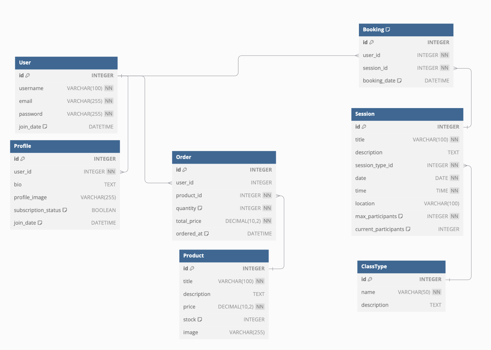

# Project Flow Summary
✅ Tested and working 🔸 Partially Implemented 🛑 Not yet implemented 💀 Feature abandoned

*	Phase 1: Set up user authentication and profile management. 
*	Phase 2: Build live session management and booking functionality.
*	Phase 3: Implement product listings, checkout, and e-commerce functionality.
*	Phase 4: Create pre-recorded video access for registered users.
*	Phase 5: Implement subscription management and payment processing.

## Phase 1: Core Setup and User Authentication

1.	Project Setup  
* **Create the Django Project**: Start by setting up the Django project and configuring the settings.  ✅  
* **Install Django**: and create the project using django-admin startproject fitness_app.  ✅  
* **Config**: Set up basic configurations, including database settings.  ✅  
* **Install Required Packages**: Install packages for authentication (django-allauth), handling static files, etc.  ✅
* **Define Data Model**: Define data model based on project requirements

2.	Users App: Authentication and Profile Setup  
* **Create the users app**: Set up user authentication using Django’s built-in user model and extend it with a Profile model.  ✅  
* **Build Registration & Login Pages**: Create the registration and login views, using django-allauth. ✅ 
* **Create User Profile Management**: Add functionality for users to view and update their profile.  ✅ 
  * make sure update profile form fields are hidden unless button clicked✅
* **Create URLs and Templates**: Implement URLs for registration, login, and profile management, and create basic templates (register.html, login.html, profile.html).  ✅
* **Test Authentication**: Make sure users can sign up, log in, and manage their profiles. Testing this early is critical, as it’s the foundation of the project.  ✅
* **Add Content to Homepage**: Add copy and images to homepage to show instantly what site is about. ✅  

## Phase 2: Live Session Booking

1.	Sessions App: Live Fitness Sessions and Bookings: Personal training and Group sessions  
* **Create the sessions app**: Set up models for live sessions (Session and ClassType) and bookings (Booking).  ✅  
* **Build Live Session Listings**: Create views and templates to list all upcoming live sessions and allow users to book limited spaces.  ✅  
* **Build Booking Functionality**: Ensure that registered users can book sessions, and handle capacity limits (max participants).  ✅  
* **Build Dashboard for Managing Bookings**: Update the user dashboard to display booked sessions and allow users to cancel bookings if needed.   ✅  
  * If a session is cancelled and goes from 'full' to 'not full', how do I remove 'disabled' class from html 'book now' button? ❓❓❓
* **URLs and Templates**: Implement URLs for session listings (/sessions/), booking (/sessions/<id>/book/), and bookings management.  
* **Notifications**: Add email or SMS notifications for session bookings and reminders.
* **Calendar Integration**: Allow users to add booked sessions to their personal calendars.

## Phase 3: Products and E-commerce

1.	Products App: Fitness Products and Merchandise
* **Create the products app**: Set up the product model (Product), and create the views and templates to list products. ✅  
*	**Build Product Pages**: Create pages that display all products and individual product details. ✅
* **Style Pages**: Style pages using bootstrap template ✅  
* **Add Discount?**: Consider adding discounted_price / on_sale to data model. How could this interact with membership?
*	**URLs and Templates**: Build URLs for product listing (/products/) and checkout (/checkout/), and create associated templates. ✅  
* **Product Categories**: Add product categories for better organization. ✅  
* **Search Functionality**: Implement a search feature to help users find products easily.
* **Inventory Management**: Include inventory tracking to manage stock levels.
* **Order History**: Add model to track order histor in django admin ✅  
* Field called user type: user, staff, admin
* Hide login/signup
* add 'view bookings', view orders etc, buttons for staff
* staff should be able to add sessions, products
* Amazon S3 
* Create unit tests - test the views, models, forms, for any/all apps

2. Cart App: VCreate bespoke app for cart, separate to Products
*	**Implement Checkout (Non-Subscription Products)**: Add a simple cart and checkout system for products, integrating with Stripe 


## Phase 4: Pre-recorded Videos (On-Demand Content)
 
1.	Videos App: Pre-recorded Fitness Videos  
* **Create the videos app**: Set up a model for videos (Video), and create views for listing and watching videos.  
* **Restrict Access to Registered Users**: Ensure that only registered users can access the video library.  
* **URLs and Templates**: Create URLs for listing videos (/videos/) and watching videos (/videos/<id>/).  
* * **Video Quality**: Ensure videos are optimized for different devices and internet speeds.  
* **Comments/Feedback**: Allow users to leave comments or feedback on videos.  

## Phase 5: Payments, Subscriptions, and Final Polish

1.	Subscriptions App: Payment and Subscription Management  
* **Implement Subscription Model**: Set up the Subscription model to manage recurring payments for access to premium content (live sessions and videos).  
* **Integrate Stripe/PayPal**: Implement payment integration for subscription-based access to premium content.  
* **Build Checkout for Subscription**: Create the checkout process for users to subscribe and manage payments.  
* **URLs and Templates**: Create the subscription-related URLs (/subscriptions/checkout/), and ensure the system ties into the user’s dashboard and session access.  
* **Payment Security**: Ensure PCI compliance for handling payments.
* **Subscription Tiers**: Offer different subscription tiers with varying levels of access.


2.	Final Polish  
* **Add Reviews for Products/Sessions**: Add a reviews feature where users can leave feedback on products or sessions.  
* **Test and Debug**: Conduct thorough testing of all user flows, particularly with respect to authentication, payments, and session booking.  
* **Responsive Design**: Ensure the site works well on mobile devices and tablets, especially for users booking live sessions on the go.  
* **Analytics**: Implement analytics to track user engagement and sales.

____________________________________
Welcome William Saunders,

This is the Code Institute student template for Gitpod. We have preinstalled all of the tools you need to get started. It's perfectly ok to use this template as the basis for your project submissions.

You can safely delete this README.md file or change it for your own project. Please do read it at least once, though! It contains some important information about Gitpod and the extensions we use. Some of this information has been updated since the video content was created. The last update to this file was: **June 18, 2024**

## Gitpod Reminders

To run a frontend (HTML, CSS, Javascript only) application in Gitpod, in the terminal, type:

`python3 -m http.server`

A blue button should appear to click: _Make Public_,

Another blue button should appear to click: _Open Browser_.

To run a backend Python file, type `python3 app.py` if your Python file is named `app.py`, of course.

A blue button should appear to click: _Make Public_,

Another blue button should appear to click: _Open Browser_.

By Default, Gitpod gives you superuser security privileges. Therefore, you do not need to use the `sudo` (superuser do) command in the bash terminal in any of the lessons.

To log into the Heroku toolbelt CLI:

1. Log in to your Heroku account and go to *Account Settings* in the menu under your avatar.
2. Scroll down to the *API Key* and click *Reveal*
3. Copy the key
4. In Gitpod, from the terminal, run `heroku_config`
5. Paste in your API key when asked

You can now use the `heroku` CLI program - try running `heroku apps` to confirm it works. This API key is unique and private to you, so do not share it. If you accidentally make it public, you can create a new one with _Regenerate API Key_.

### Connecting your Mongo database

- **Connect to Mongo CLI on a IDE**
- navigate to your MongoDB Clusters Sandbox
- click **"Connect"** button
- select **"Connect with the MongoDB shell"**
- select **"I have the mongo shell installed"**
- choose **mongosh (2.0 or later)** for : **"Select your mongo shell version"**
- choose option: **"Run your connection string in your command line"**
- in the terminal, paste the copied code `mongo "mongodb+srv://<CLUSTER-NAME>.mongodb.net/<DBname>" --apiVersion 1 --username <USERNAME>`
  - replace all `<angle-bracket>` keys with your own data
- enter password _(will not echo **\*\*\*\*** on screen)_

------

## Release History

We continually tweak and adjust this template to help give you the best experience. Here is the version history:

**June 18, 2024,** Add Mongo back into template

**June 14, 2024,** Temporarily remove Mongo until the key issue is resolved

**May 28 2024:** Fix Mongo and Links installs

**April 26 2024:** Update node version to 16

**September 20 2023:** Update Python version to 3.9.17.

**September 1 2021:** Remove `PGHOSTADDR` environment variable.

**July 19 2021:** Remove `font_fix` script now that the terminal font issue is fixed.

**July 2 2021:** Remove extensions that are not available in Open VSX.

**June 30 2021:** Combined the P4 and P5 templates into one file, added the uptime script. See the FAQ at the end of this file.

**June 10 2021:** Added: `font_fix` script and alias to fix the Terminal font issue

**May 10 2021:** Added `heroku_config` script to allow Heroku API key to be stored as an environment variable.

**April 7 2021:** Upgraded the template for VS Code instead of Theia.

**October 21 2020:** Versions of the HTMLHint, Prettier, Bootstrap4 CDN and Auto Close extensions updated. The Python extension needs to stay the same version for now.

**October 08 2020:** Additional large Gitpod files (`core.mongo*` and `core.python*`) are now hidden in the Explorer, and have been added to the `.gitignore` by default.

**September 22 2020:** Gitpod occasionally creates large `core.Microsoft` files. These are now hidden in the Explorer. A `.gitignore` file has been created to make sure these files will not be committed, along with other common files.

**April 16 2020:** The template now automatically installs MySQL instead of relying on the Gitpod MySQL image. The message about a Python linter not being installed has been dealt with, and the set-up files are now hidden in the Gitpod file explorer.

**April 13 2020:** Added the _Prettier_ code beautifier extension instead of the code formatter built-in to Gitpod.

**February 2020:** The initialisation files now _do not_ auto-delete. They will remain in your project. You can safely ignore them. They just make sure that your workspace is configured correctly each time you open it. It will also prevent the Gitpod configuration popup from appearing.

**December 2019:** Added Eventyret's Bootstrap 4 extension. Type `!bscdn` in a HTML file to add the Bootstrap boilerplate. Check out the <a href="https://github.com/Eventyret/vscode-bcdn" target="_blank">README.md file at the official repo</a> for more options.

------

## FAQ about the uptime script

**Why have you added this script?**

It will help us to calculate how many running workspaces there are at any one time, which greatly helps us with cost and capacity planning. It will help us decide on the future direction of our cloud-based IDE strategy.

**How will this affect me?**

For everyday usage of Gitpod, it doesn’t have any effect at all. The script only captures the following data:

- An ID that is randomly generated each time the workspace is started.
- The current date and time
- The workspace status of “started” or “running”, which is sent every 5 minutes.

It is not possible for us or anyone else to trace the random ID back to an individual, and no personal data is being captured. It will not slow down the workspace or affect your work.

**So….?**

We want to tell you this so that we are being completely transparent about the data we collect and what we do with it.

**Can I opt out?**

Yes, you can. Since no personally identifiable information is being captured, we'd appreciate it if you let the script run; however if you are unhappy with the idea, simply run the following commands from the terminal window after creating the workspace, and this will remove the uptime script:

```
pkill uptime.sh
rm .vscode/uptime.sh
```

**Anything more?**

Yes! We'd strongly encourage you to look at the source code of the `uptime.sh` file so that you know what it's doing. As future software developers, it will be great practice to see how these shell scripts work.

---

Happy coding!
* Data Model:


* References  
  * https://dev.to/chukslord1/building-an-appointment-scheduler-app-with-django-and-fauna-2n9o
  * https://www.youtube.com/watch?v=XX8O2JNIOQo
  * https://docs.djangoproject.com/en/5.1/ref/contrib/messages/
  * https://channels.readthedocs.io/en/latest/introduction.html#turtles-all-the-way-down
  * https://docs.fontawesome.com/web/use-with/python-django
  * https://docs.djangoproject.com/en/5.1/ref/request-response/#django.http.HttpRequest.META